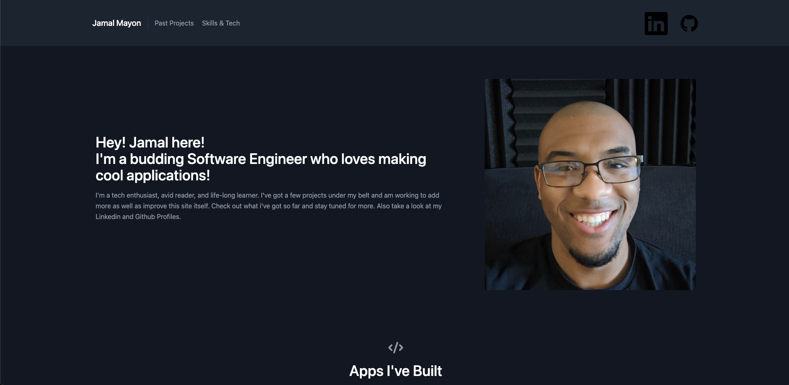
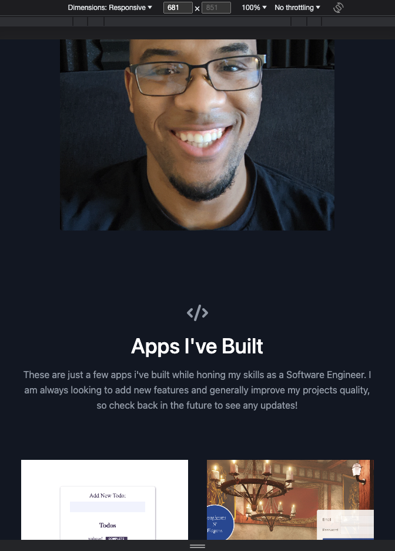
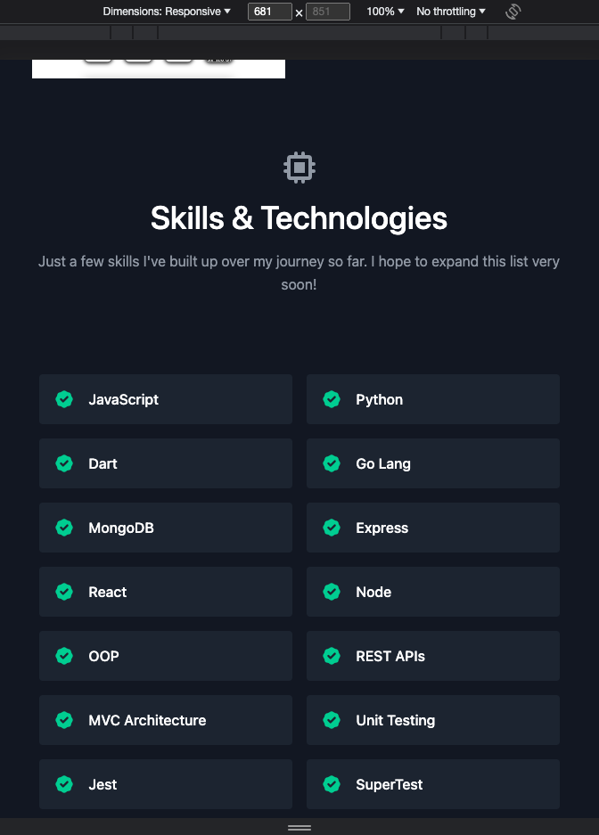
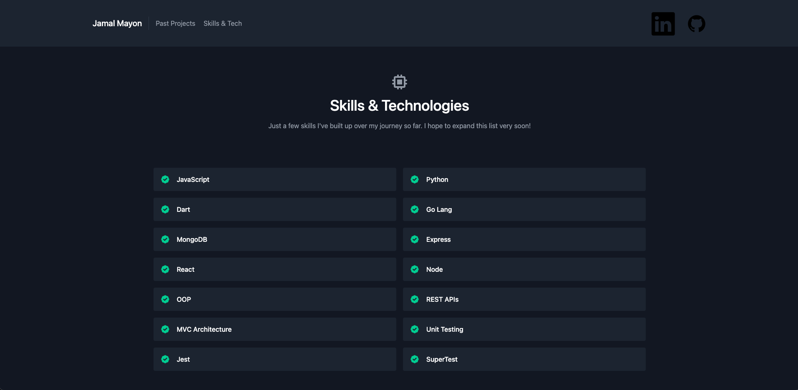

# Portfolio

 This React App project doubled as both my Capstone for my Software Engineering Program as well as being a deliverable for its accompanying outcomes post-course program. This portfolio is a bit simple now but will have frequent updates to both its content (as new projects are made and deployed) and its design (as i get better at ux/ui). This is not a full MERN Stack Application as I am not using a database and have no data entities.

 ## Tech Used:
 React, Javascript, Tailwind CSS, dotenv, Express, Node

## Cloning The Repo

Should you wish to clone this repo and build a portfolio off of this you would need to

1. Clone the repository and then save the files to a directory of your choosing on your computer

2. Install the dependencies by running <pre>npm i</pre> in the terminal (you'll need Node.js already installed for this command to work)

3. create a .env file in your repos root directory

4. Check that the .gitignore has both the ".env" and "node_modules" files in there

5. Inside the dotenv you should put any information you don't wish to be made public (port # or perhaps a secret key etc.)

## Links:

Trello:

https://trello.com/b/KChekzQv/react-tw-portfolio

Live link:

https://jamalmayon.me/

## Screenshots:

